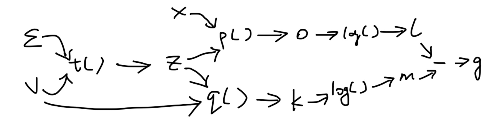

# Vecor Calculus
## 5.1
Using intermediate variables and flow chart:  
$$a = x^4 \quad \quad c = x^3$$
$$b = log(a) \quad \quad d = sin(c)$$
$$f = bd$$

We want: 

$$ 
\begin{aligned}
{\partial f \over \partial x} &= {\partial f \over \partial b}{\partial b \over \partial x} + {\partial f \over \partial d}{\partial d \over \partial x} \\
&= {\partial f \over \partial b}{\partial b \over \partial a}{\partial a \over \partial x} + {\partial f \over \partial d}{\partial d \over \partial c}{\partial c \over \partial x}
\end{aligned}
$$

First derive all elementary derivatives:
$${\partial a \over \partial x} = 4x^3 \quad \quad {\partial c \over \partial x} = 3x^2 $$ 
$${\partial b \over \partial a} = {1 \over a} \quad \quad {\partial d \over \partial c} = cos(c)$$
$${\partial f \over \partial b} = d \quad \quad {\partial f \over \partial d} = b$$

Then by backward propagation, we calculate the derivative products in *reverse* of the flow chart direction.
$$
{\partial f \over \partial a} = {\partial f \over \partial b}{\partial b \over \partial a} = {d \over a}
$$
$$
{\partial f \over \partial c} = {\partial f \over \partial d}{\partial d \over \partial c} = {bcos(c)}
$$
So 
$$
\begin{aligned}
{\partial f \over \partial x} &= {\partial f \over \partial a}{\partial a \over \partial x} + {\partial f \over \partial c}{\partial c \over \partial x} \\
&= {d\over a}{4x^3} + bcos(c) 3x^2 \\
&= {sin(x^3)\over x^4}{4x^3} + log(x^4)cos(x^3)3x^2 \\
&= {4\over x}{sin(x^3)} + 12x^2log(x)cos(x^3)
\end{aligned}
$$

## 5.2
Let 
$$
\begin{aligned}
&a = -x \quad \quad &b = e^a \\
&c =1+b \quad \quad &f = {1\over c}
\end{aligned}
$$

$$
\begin{aligned}
{\partial f \over \partial x} &= {\partial f \over \partial c}{\partial c \over \partial b}{\partial b \over \partial a}{\partial a \over \partial x} \\
&= {\left(-{1 \over {c^2}} \cdot 1\right)}{\partial b \over \partial a}{\partial a \over \partial x} \\
&= {\left(-{1 \over {c^2}} \cdot e^a\right)}{\partial a \over \partial x} \\
&= -{{e^a \over c^2} \cdot {(-1)}} = {e^a \over c^2} \\
&= {{e^{-x}} \over \left(1+e^{-x}\right)^2}
\end{aligned}
$$

## 5.3
Let $a = x-u, b=a^2, c = -{1 \over {2\sigma^2}}b, f = exp(c)$,
Then
$$
\begin{aligned}
{\partial f \over \partial x} &= {\partial f \over \partial c}{\partial c \over \partial b}{\partial b \over \partial a}{\partial a \over \partial x} \\
&= \left(e^c \cdot -{1 \over {2\sigma^2}}\right){\partial b \over \partial a}{\partial a \over \partial x} \\
&= \left({-{e^c \over {2\sigma^2}} \cdot 2a}\right){\partial a \over \partial x} \\
&= \frac {-ae^c}{\sigma^2} \cdot 1  \\
&= \frac {- (x-u)exp(-\frac{1}{2\sigma^2}(x-u)^2)}{\sigma^2}

\end{aligned}
$$

## 5.4
$$
f'(x) = cos(x) - sin(x) \\
f''(x) = -sin(x) - cos(x) \\
f^{'''}(x) = -cos(x) + sin(x) \\
f^{(4)}(x) = sin(x) + cos(x) \\
\vdots
$$
Thus
$$
\begin{aligned}
T_n &= f(0) + f'(0) \cdot x + \frac{{f''(0)}}{{2!}} \cdot x^2 + \frac{{f'''(0)}}{{3!}} \cdot x^3 + \frac{{f^{(4)}(0)}}{{4!}} \cdot x^4 + \frac{{f^{(5)}(0)}}{{5!}} \cdot x^5 \\
&= 1 + x - \frac{1}{2}x^2 - \frac{1}{6}x^3 + \frac{1}{4!}x^4 + \frac{1}{5!}x^5
\end{aligned}
$$

## 5.5
### a.
The dimensions are: 

${\partial f_1 \over \partial x} = \begin{bmatrix}
{\partial f_1 \over \partial x_1}&{\partial f_1 \over \partial x_2}
\end{bmatrix}$ with dimension $1 \times 2$

${\partial f_2 \over \partial x} = \begin{bmatrix}
{\partial f_2 \over \partial x_1}&{\partial f_2 \over \partial x_2}& \dots & {\partial f_2 \over \partial x_n}
\end{bmatrix}$ with dimension $1 \times n$

${\partial f_3 \over \partial x} = \begin{bmatrix}
{\partial f_3 \over \partial x_1}&{\partial f_3 \over \partial x_2}& \dots & {\partial f_3 \over \partial x_n}
\end{bmatrix}$ This is an $(n \times n) \times n$ tensor as each ${\partial f_3 \over \partial x_i}$ is $n \times n$ for $i = 1, 2,...,n$

b. 
$$
{\partial f_1 \over \partial x} = \begin{bmatrix}
{cos(x_1)cos(x_2)}&-sin(x_1)sin(x_2)
\end{bmatrix}
$$
$$
{\partial f_2 \over \partial x} = \begin{bmatrix}
{y_1}& y_2 & \dots & y_n 
\end{bmatrix} = y^T
$$

$f_3$: Let $f_3(x) = K = xx^T =  \begin{bmatrix} x_1^2 & x_1x_2 & x_1x_3 \\
    x_2x_1 & x_2^2 & x_2x_3 \\
    x_3x_1 & x_3x_2 & x_3^2 \end{bmatrix}\in \R^{n\times n} $

We see that $K_{pq} = x_px_q$, so 
$
{\partial K_{pq} \over \partial x_i} = \lambda_{pqi}
$ where $\lambda_{pqi} = \begin{cases}
    2x_{i}, & \text{i=q=p}\\
    x_p, & p \neq q, i = q\\
    x_q, & p \neq q, i = p\\
    0,              & \text{else}
\end{cases}$

We see that $\frac{\partial K}{\partial x}$ has dimension $(n \times n) \times n$ where each entry is given by $\lambda_{pqi}$ with $p, q, i = 1, 2, \dots, n$.

## 5.6
$$
\begin{aligned}
\frac{\partial f}{\partial t} &= \begin{bmatrix}
{\partial f \over \partial t_1}&{\partial f \over \partial t_2}& \dots & {\partial f \over \partial t_n}
\end{bmatrix}_{1 \times D} \\
&= cos(log(t^Tt))\cdot \frac{1}{t^Tt} \cdot \begin{bmatrix} 2t_1 & 2t_2 & \dots & 2t_n
\end{bmatrix} \quad \quad \text{*using chain rule}\\
&= 2 cos(log(t^Tt)) \frac{t^T}{t^Tt}
\end{aligned}
$$

$\frac{\partial g}{\partial x}$: Let $M = g(X)$
$$
M = \text{}tr\left( 

\right)
$$

$$
A = \begin{bmatrix}
    a_{11} & a_{12} & \cdots & a_{1E} \\
    a_{21} & a_{22} & \cdots & a_{2E} \\
    \vdots & \vdots & \ddots & \vdots \\
    a_{D1} & a_{D2} & \cdots & a_{DE}
\end{bmatrix}, 
X = \begin{bmatrix}
    x_{11} & x_{12} & \cdots & x_{1F} \\
    x_{21} & x_{22} & \cdots & x_{2F} \\
    \vdots & \vdots & \ddots & \vdots \\
    x_{E1} & x_{E2} & \cdots & x_{EF}
\end{bmatrix},
B = \begin{bmatrix}
    b_{11} & b_{12} & \cdots & b_{1D} \\
    b_{21} & b_{22} & \cdots & b_{2D} \\
    \vdots & \vdots & \ddots & \vdots \\
    b_{F1} & b_{F2} & \cdots & b_{FD}
\end{bmatrix}
$$

$$
\begin{aligned}
AXB &= 
\begin{bmatrix}
    \sum_{k=1}^{E} a_{1k}x_{k1} & \sum_{k=1}^{E} a_{1k}x_{k2} & \cdots & \sum_{k=1}^{E} a_{1k}x_{kF} \\
    \sum_{k=1}^{E} a_{2k}x_{k1} & \sum_{k=1}^{E} a_{2k}x_{k2} & \cdots & \sum_{k=1}^{E} a_{2k}x_{kF} \\
    \vdots & \vdots & \ddots & \vdots \\
    \sum_{k=1}^{E} a_{Dk}x_{k1} & \sum_{k=1}^{E} a_{Dk}x_{k2} & \cdots & \sum_{k=1}^{E} a_{Dk}x_{kF} 
\end{bmatrix}
\begin{bmatrix}
    b_{11} & b_{12} & \cdots & b_{1D} \\
    b_{21} & b_{22} & \cdots & b_{2D} \\
    \vdots & \vdots & \ddots & \vdots \\
    b_{F1} & b_{F2} & \cdots & b_{FD}
\end{bmatrix} \\
&= \begin{bmatrix}
    \sum_{j=1}^{F}\sum_{k=1}^{E} a_{1k}x_{kj}b_{j1} &  &  &  \\
     & \sum_{j=1}^{F}\sum_{k=1}^{E} a_{2k}x_{kj}b_{j2} &  &  \\
     &  & \ddots &  \\
     &  &  & \sum_{j=1}^{F}\sum_{k=1}^{E} a_{Dk}x_{kj}b_{jd} 
\end{bmatrix}
\end{aligned}
$$

Then 
$$
\begin{aligned}
tr(AXB) &= tr\left(\begin{bmatrix}
    \sum_{j=1}^{F}\sum_{k=1}^{E} a_{1k}x_{kj}b_{j1} &  &  &  \\
     & \sum_{j=1}^{F}\sum_{k=1}^{E} a_{2k}x_{kj}b_{j2} &  &  \\
     &  & \ddots &  \\
     &  &  & \sum_{j=1}^{F}\sum_{k=1}^{E} a_{Dk}x_{kj}b_{jd} 
\end{bmatrix} \right) \\
&= \sum_{l}^D\sum_{j}^{F}\sum_{k}^{E} a_{lk}x_{kj}b_{jl} \\
&= \sum_{l}^D\sum_{j}^{F}(a_{l1}x_{1j}b_{jl}+a_{l2}x_{2j}b_{jl} + \cdots + a_{le}x_{ej}b_{jl}) \\
&= \sum_{l}^D(a_{l1}x_{11}b_{1l}+a_{l2}x_{21}b_{1l} + \cdots + a_{le}x_{e1}b_{1l}) + (a_{l1}x_{12}b_{2l}+a_{l2}x_{22}b_{2l} + \cdots + a_{le}x_{e2}b_{2l}) + \cdots
\end{aligned}
$$
We see that for each $\frac{\partial M}{\partial x_{ij}}$, only one term in $tr(AXB)$ contains $x_{ij}$: $\sum_{l}^Da_{li}x_{ij}b_{jl}$. Therefore
$$
\frac{\partial M}{\partial x_{ij}} = \sum_{l}^Da_{li}b_{jl} \quad \quad \frac{\partial M}{\partial x}= (BA)^T
$$

## 5.7
### a. 
$$
\begin{aligned}
{\partial f \over \partial x} &= {\partial f \over \partial z}{\partial z \over \partial x} \quad \quad \quad \text{where } {\partial f \over \partial z} \in \R \text{ and }{\partial z \over \partial x} \text{ has dimension 1xD}\\
&= {1\over {1+z}}{\begin{bmatrix}
    2x_1& 2x_2 & \dots & 2x_D \\
\end{bmatrix} }  \\
&= {{1\over {1+x^Tx}} \cdot {2x^T}} \\
&= \frac{2x^T}{{1 + x^Tx}}
\end{aligned}
$$

### b.
$$
{\partial f \over \partial z} = cos(z) = 
\begin{bmatrix}
  \cos(z_1) & 0 & \cdots & 0 \\
  0 & \cos(z_2) & \cdots & 0 \\
  \vdots & \vdots & \ddots & \vdots \\
  0 & 0 & \cdots & \cos(z_e)
\end{bmatrix}_{E \times E}
$$

$
{\partial z \over \partial x}
$: We know that $z_i = \sum_{j=1}^{D} a_{ij} x_j + b_i$, then ${\partial z_i \over \partial x_j} = a_{ij}$. So
$$
{\partial z \over \partial x} = A 
$$
Finally using chain rule:
$$
\begin{aligned}

{\partial f \over \partial x} &= {\partial f \over \partial z}{\partial z \over \partial x} \\
&= cos(Ax + b) \cdot A \text{ with dimension }E \times D
\end {aligned}
$$ 

## 5.8 
### a.
$$
\frac{df}{dz} = -0.5\exp(-0.5z)
$$
As $z = y^T S^{-1} y$, we have:

$$
 y^T S^{-1} = \begin{bmatrix}
y_1 & y_2 & \dots & y_D
\end{bmatrix}
\begin{bmatrix}
(S^{-1})_{11} & (S^{-1})_{12} & \dots & (S^{-1})_{1D} \\
(S^{-1})_{21} & (S^{-1})_{22} & \dots & (S^{-1})_{2D} \\
\vdots & \vdots & \ddots & \vdots \\
(S^{-1})_{D1} & (S^{-1})_{D2} & \dots & (S^{-1})_{DD}
\end{bmatrix}  $$
We can find the $i$-th component of $y^T S^{-1}$ is $\sum_{j=1}^{D} y_j (S^{-1})_{ji} \quad \text{for } i = 1, 2, \ldots, D \
$

Then

$$ z = \sum_{i=1}^{D} (y^T S^{-1})_i y_i = \sum_{i=1}^{D} \left( \sum_{j=1}^{D} y_j (S^{-1})_{ji} \right) y_i 
$$

Then we could find $\frac{dz}{dy_k}$ for each component $y_k$ of $y$ by evaluating cases where $k = i$ or $k = j$, and putting them together in a vector to get $\frac{dz}{dy}$. However, it is easier to simply apply formula (5.107) to get 

$$
\frac{dz}{dy} = y^T(S^{-1} + (S^{-1})^T)
$$
    
**parts of the matrix operations are generated by ChatGPT 3.5*

Lastly: 
$$
\frac{dy}{dx} = 
\begin{bmatrix}
\frac{{\partial y_1}}{{\partial x_1}} & \frac{{\partial y_1}}{{\partial x_2}} & \dots & \frac{{\partial y_1}}{{\partial x_D}} \\
\frac{{\partial y_2}}{{\partial x_1}} & \frac{{\partial y_2}}{{\partial x_2}} & \dots & \frac{{\partial y_2}}{{\partial x_D}} \\
\vdots & \vdots & \ddots & \vdots \\
\frac{{\partial y_D}}{{\partial x_1}} & \frac{{\partial y_D}}{{\partial x_2}} & \dots & \frac{{\partial y_D}}{{\partial x_D}}
\end{bmatrix} = I_{D}
$$

So 
$$
\frac{df}{dx} = -\frac{1}{2}exp(-\frac{1}{2}z)y^T(S^{-1} + (S^{-1})^T)
$$

### b.

$$ 
XX^T = \begin{bmatrix}
(x_1)^2 & x_1 \cdot x_2 & \cdots & x_1 \cdot x_D \\
x_2 \cdot x_1 & (x_2)^2 & \cdots & x_2 \cdot x_D \\
\vdots & \vdots & \ddots & \vdots \\
x_D \cdot x_1 & x_D \cdot x_2 & \cdots & (x_D)^2 \\
\end{bmatrix}$$

$$
\begin{aligned}
y &= f(x) \\ 
&= tr\left( 
\begin{bmatrix}
(x_1)^2 & x_1 \cdot x_2 & \cdots & x_1 \cdot x_D \\
x_2 \cdot x_1 & (x_2)^2 & \cdots & x_2 \cdot x_D \\
\vdots & \vdots & \ddots & \vdots \\
x_D \cdot x_1 & x_D \cdot x_2 & \cdots & (x_D)^2 \\
\end{bmatrix} + \begin{bmatrix}
\sigma^2 & 0 & \cdots & 0 \\
0 & \sigma^2 & \cdots & 0 \\
\vdots & \vdots & \ddots & \vdots \\
0 & 0 & \cdots & \sigma^2 \\
\end{bmatrix}
\right) \\
&=  D\sigma^2 + \sum_{i=1}^D{x_i}^2
\end{aligned}
$$

Hence 
$$
\frac{\partial y}{\partial x} = \begin{bmatrix} 2x_1 & 2x_2 & \dots & 2x_d 
\end{bmatrix}
 = 2x^T
$$

### c. 
$$
\frac{{df}}{{dz}} = \begin{bmatrix}
    \text{sech}^2(z_1) & 0 & \cdots & 0 \\
    0 & \text{sech}^2(z_2) & \cdots & 0 \\
    \vdots & \vdots & \ddots & \vdots \\
    0 & 0 & \cdots & \text{sech}^2(z_m)
\end{bmatrix}_{M \times M}
$$
$$
\frac{{dz}}{{dx}} = A_{M \times N}
$$

## 5.9
Let $l = log (p(x,z))$, $m = log(q(z, v))$, then $g(x, z, v) = l - m$. 

Using intermediate variables and flow chart:  
$$ l = log(o) \quad \quad m = log(k)$$
$$ o = p(x, z) \quad \quad k = q(z, v)$$
$$z = t(e, v)$$

By chain rule:
$$
\begin{aligned}
{\partial g \over \partial v} &= {\partial g \over \partial l}{\partial l \over \partial o}{\partial o \over \partial z}{\partial z \over \partial v} - {\partial g \over \partial m}{\partial m \over \partial k}{\partial k \over \partial v}\\
&= 1 \cdot \frac{1}{o} \cdot p'(x, z) \cdot t'(e,v) - 1 \cdot \frac{1}{k} \cdot q'(z, v) \cdot t'(e, v) \\
&= \frac{p'(x,t(e,\nu))\cdot t'(e,\nu) }{p(x,t(e,\nu))} - \frac{q'(t(e,\nu),\nu)\cdot t'(e,\nu)}{q(t(e,\nu),\nu)}
\end{aligned}
$$
